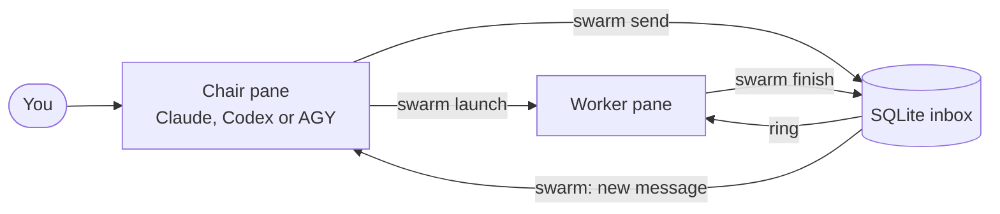

# swarm

Message bus and pane control for a tree of agent CLIs. One agent, the chair, starts other agent
CLIs (Claude Code, Codex, or AGY) in visible terminal panes, sends them work, and collects their
answers. You see every worker and can type into any of them.


## How it works

An example: you ask Claude Code in a tmux pane to "have a cheap model add a `version()` function".

1. The chair runs `swarm session new lane`. Swarm records a session and registers the chair's pane.
2. The chair runs `swarm launch version-worker code.small --cwd "$PWD"`. Swarm reads the
   `code.small` profile, takes its first runner that can run (for example AGY on a Gemini Flash
   model), splits a pane, and starts that CLI in it.
3. The chair runs `swarm send version-worker ask` with the task on stdin. Swarm stores the message
   in its SQLite inbox and types a short ring into the worker's pane.
4. The worker does the task and runs `swarm finish` with its answer. Swarm stores the answer and
   rings the chair's pane with `swarm: new message`.
5. The chair runs `swarm inbox`, reads the answer, runs `swarm ack`, and closes the worker with
   `swarm close version-worker`.



Swarm itself does no AI work. It owns the session, the panes, the messages, and the choice of
model. Each agent learns its part from a skill: `swarm-orchestrator` for the chair and
`swarm-voice` for a worker. A worker that exits without an answer is caught by `swarm sweep`, and
`swarm drain` writes a summary from its log.

Panes live in [tmux](https://github.com/tmux/tmux) (the default) or in
[Herdr](https://github.com/herdrdev/herdr). In a Herdr pane, swarm picks Herdr by itself.
Swarm.app is a macOS chat window over the same sessions.

## Install

The CLI with Homebrew (macOS). This also installs tmux:

```sh
brew tap priyanshuupadhyay/tap
brew trust --tap priyanshuupadhyay/tap   # Homebrew 6 or newer
brew install priyanshuupadhyay/tap/swarm
swarm init                               # creates ~/.swarm with the db, runs/, and adapters/
```

From a clone: `cargo install --path .`, then `swarm init`. Update with
`brew upgrade priyanshuupadhyay/tap/swarm`.

### Swarm app

The app needs macOS 26 (Tahoe) or newer. The cask also installs the CLI and tmux:

```sh
brew install --cask priyanshuupadhyay/tap/swarm-app
```

Or download `Swarm-<version>.dmg` from the
[latest release](https://github.com/PriyanshuUpadhyay/swarm/releases/latest), open it, and drag
Swarm onto Applications. The app carries its own `swarm` CLI. It still needs tmux
(`brew install tmux`) and at least one agent CLI (`claude`, `codex`, or `agy`).

The app is not notarized by Apple, so macOS blocks the first launch. Allow it once:

1. Open Swarm from Applications. macOS says it cannot verify the app. Click **Done**.
2. Open **System Settings > Privacy & Security** and scroll to **Security**.
3. Next to "Swarm was blocked", click **Open Anyway**, then confirm with your password.

On macOS 15 and later, a Control-click on the app and **Open** no longer skips this check.
If **Open Anyway** does not show, run `xattr -dr com.apple.quarantine /Applications/Swarm.app`.

## Set up

1. **Install an agent CLI and sign in.** Swarm starts [Claude Code](https://docs.claude.com/en/docs/claude-code),
   [Codex](https://github.com/openai/codex), and AGY. A runner whose CLI is not on `PATH` is skipped.
2. **Link the swarm skills.** The chair and the workers learn the protocol from `skills/`. Clone
   this repo and run the script from the `main` checkout. It links each skill into
   `~/.claude/skills`, `~/.agents/skills` (Codex), and `~/.gemini/config/skills` (AGY):

   ```sh
   git clone https://github.com/PriyanshuUpadhyay/swarm ~/swarm
   sh ~/swarm/scripts/install.sh
   ```

3. **Check your profiles.** A profile maps a role, such as `code.small` or `review.deep`, to an
   ordered list of runners (provider, model, effort). Swarm ships defaults in
   `default-profiles.json`. Edit them on the app's Home, or read them with
   `swarm roles check --json`. [Profiles](#profiles-and-runners) has the details.
4. **Allow the Codex and AGY hooks.** On first launch the app asks
   "Let swarm set up its own hooks for Codex and AGY?". Click **Set up**, so worker columns show
   their chat and state. Claude needs no step. You can do it later from
   **Swarm > Set Up Agent Hooks…**, or in a terminal with `swarm hooks setup`.

### Optional: accounts with yelo

[yelo](https://github.com/PriyanshuUpadhyay/yelo) keeps more than one Claude or Codex account
(profiles) and reads how much usage each one has left. Swarm uses it when it is on `PATH`:

- `swarm launch --account auto` starts the worker on the account with the most usage left, the
  same answer as `yelo profile pick`. `--account work` takes the account named `work`. Without
  `--account`, yelo's `claude` or `codex` command in the pane picks the account.
- A runner whose best account has less than `min_usage_left_pct` (default 5%) left is skipped, so
  the launch falls through to the next runner.
- `swarm accounts --provider claude --json` and `swarm usage --json` show what yelo reports, and
  the app shows it on the account row of Switch model.

```sh
brew install priyanshuupadhyay/tap/yelo
yelo setup
yelo profile create --cli claude work
claude --profile work auth login
```

Without yelo, each CLI uses its own login. AGY has no account source yet.

### Optional: workflow skills from agent-kit

[agent-kit](https://github.com/PriyanshuUpadhyay/agent-kit) has workflow skills that run their
workers as visible swarm panes:

| Skill | What it does with swarm |
|---|---|
| [`council`](https://github.com/PriyanshuUpadhyay/agent-kit/tree/main/skills/council) | Claude, GPT, and Gemini voices debate in panes and end in one verdict |
| [`web-search`](https://github.com/PriyanshuUpadhyay/agent-kit/tree/main/skills/web-search) | Three seats search different parts of the web; the chair merges |
| [`research`](https://github.com/PriyanshuUpadhyay/agent-kit/tree/main/skills/research) | Answers one question in a short report; can send the web part to a `search.web` seat |
| [`review-check`](https://github.com/PriyanshuUpadhyay/agent-kit/tree/main/skills/review-check) | Seats judge each changed unit of a diff; a script gives the verdict |
| [`orchestrate-claude`](https://github.com/PriyanshuUpadhyay/agent-kit/tree/main/skills/orchestrate-claude), [`-codex`](https://github.com/PriyanshuUpadhyay/agent-kit/tree/main/skills/orchestrate-codex), [`-agy`](https://github.com/PriyanshuUpadhyay/agent-kit/tree/main/skills/orchestrate-agy) | Bind a skill's worker needs to each agent CLI |

The roles these skills ask for (`council.gpt`, `search.web`, `review.deep`, and others) are the
profile names in `default-profiles.json`. The
[agent-kit README](https://github.com/PriyanshuUpadhyay/agent-kit#install) shows how to link the skills.

## Use it

### From a terminal

Start your agent CLI inside tmux, or in a Herdr pane, and ask it to use swarm:

```sh
tmux new -s work
claude
> Use swarm to have a code.small worker add a version() function to src/health.ts.
```

The chair follows `swarm-orchestrator`, and the worker pane opens beside it.

### From the app

1. Click **Open Project…** and choose a folder. Swarm adds the project and starts a chat in it
   with the `chat` profile. A Git project can also get a workspace (a branch in its own worktree)
   from **Create workspace**.
2. To use another model, click **Switch model** in the chat.
3. Type your task. When the chair launches a worker, the worker's pane opens as a column to the
   right of the chat, and you can type into it.


## Swarm app reference

Swarm.app opens on Home, where routed roles show their models. Open Project adds a folder to the
project list and starts a chat in it. Create Project makes a plain folder, adds it there, and starts a chat in it.
New chat starts the chat profile at once with no sheet (ADR 0035): a "New chat" tab shows at once and becomes the
chat when the chair is up, or shows the launch error with Retry. To use another model, start a chat and use Switch
model. Codex and AGY list CLI models; Claude lists aliases and accepts a full model name in Other model. In a chat,
Switch model asks the live chair
for a compact summary, starts the chosen Claude or Codex model, and keeps both parts in one chat
tab. If the old pane has closed, the new chair receives recent messages and makes its own compact
summary.

For a Git project, Create workspace starts a branch from the default branch in a worktree beside the
project, then starts a chat there. Empty task worktrees stay in the sidebar with 0 chats.
Plain folders keep the New chat action without Git worktrees.
The sidebar lists one row per workspace across projects, in Pinned and My workspaces. Search
finds workspace names, projects, branches, and chat titles. Chats in the selected workspace appear
as underlined tabs above the transcript. The plus button starts another chat in that workspace.
Pins, workspace names, and the last selected chat survive restarts. Archive workspace hides its
row without deleting files, archiving chats, or stopping agents; Archived offers Restore workspace.
Herdr-hosted agents with live panes attach through Herdr's direct terminal stream, so the pane
accepts input in Swarm. A closed connection can be reopened with Reconnect.

## Environment

When `SWARM_HOME` is not set, a build from `main` (or from a detached HEAD) uses `HOME`, and a
build from any other branch uses `~/.swarm-<branch>`, so a branch build never touches the real data
(ADR 0027). A branch name with a character outside `[a-z0-9._-]`, one that starts with `.` or
`-`, or one over 200 bytes gets its letters made lowercase and its other unsafe bytes made `-`, is cut
to 200 bytes, and gets a hash of the whole name added, so `feat/login` uses
`~/.swarm-feat-login+407712bf7898fb7f` and never meets `feat-login`. An uppercase letter also takes
the hash, because the default macOS disk ignores case, so `Feature` and `feature` get two folders. `branch_folder` in `src/paths.rs`
states the exact rule.
`swarm --version` prints the branch after the commit. An explicit `SWARM_HOME` always wins. The data
directory is always `$SWARM_HOME/.swarm`.

| Variable | Meaning |
|---|---|
| `SWARM_HOME` | Parent of the `.swarm/` data directory. Defaults to `$HOME`, or `~/.swarm-<branch>` for a branch build. |
| `SWARM_ADAPTER` | Adapter file name under `.swarm/adapters/`. Defaults to `herdr` in a Herdr pane, else `tmux`. |
| `AGENT_ROUTING_CONFIG` | The old routing file that the first read imports. A path that does not exist is an error. |
| `SWARM_SESSION_ID` | Session the caller belongs to. `spawn` stamps it into each child pane. |
| `SWARM_AGENT_ID` | Identity of the caller. `spawn` stamps it into each child pane. |
| `SWARM_SUMMARIZER` | Shell line `drain` runs with a log on stdin. Required by `drain` only. |

## Profiles and runners

Agent profiles live in `$SWARM_HOME/.swarm/profiles.json` (ADR 0031). A profile is one role, such
as `chat` or `code.complex`, with an ordered list of runners. A runner is a provider, a model, an
effort, and the flags its provider takes. `chat` is always first. With no file, the first read
imports the old routing file (`$AGENT_ROUTING_CONFIG`, else
`$XDG_CONFIG_HOME/agent-routing/roles.json`, else `~/.config/agent-routing/roles.json`) and writes
`profiles.json`. Each route becomes a profile whose runners are the route's runners, then their
substitutes. The old file is never written, and a later edit to it only prints a warning. With
neither file, the `default-profiles.json` built into the binary is used and nothing is written until
the first save. A file that is a broken symlink is an error, never a silent switch to the default.
A save writes through a symlink, so `profiles.json` can live in a dotfiles checkout.

A launch takes the first runner that can run (ADR 0032). It skips a runner whose CLI is not on
PATH, whose accounts are all signed out, or whose best account has less usage left than
`min_usage_left_pct` (default 5). The account read has a 2 s deadline; a read that fails, times
out, or finds no accounts counts as "can run". Each skip is one stderr line, such as
`swarm: code.complex: skipped claude/opus/high: usage 2% left (threshold 5%)`, and a launch where
no runner can run fails with one line per runner.

## Commands

Caller `any` needs no identity. `session` needs a session, and `agent` needs a session and an agent
id. A chair gets both from its pane, which `swarm session new` registers. A child gets
`SWARM_SESSION_ID` and `SWARM_AGENT_ID`, which `launch` and `spawn` stamp into its pane. The
`orchestrator` caller also must match the session's orchestrator agent.

| Command | Caller | Effect and output |
|---|---|---|
| `--version` | any | Print the package version and build commit. |
| `init` | any | Create `.swarm/`, `runs/`, `adapters/`, and the database. Shipped adapters stay in the binary; matching old disk copies are removed. |
| `adapter check <name>` | any | Load the shipped adapter plus any disk overrides. Print the verbs that the disk file overrides. |
| `session new <lane\|relay\|open> [--chair <claude\|codex>:<id>]` | any | Create a session for the physical current directory (`pwd -P`) and print its UUID v7 id. Without `--chair`, use a chair id from the current CLI environment when present. |
| `session chair <claude\|codex>:<id>` | orchestrator | Set the chair transcript id. Refuse any other agent. |
| `session continue <new_id> <old_id>` | any | Link a newer session to an older session in the same directory after the new chair receives its context. |
| `session archive <id>...` | any | Archive one or more UUID v7 sessions. |
| `sessions --json` | any | List active sessions and resolved chair logs as JSON. |
| `host-context --provider <claude\|codex\|agy>` | any | Print the session's host contract in that provider's hook format, or nothing outside a visible host. |
| `hook <claude\|codex\|agy> [event]` | any | Read a provider hook's JSON on stdin and record the agent's state (`working`, `waiting`, `done`, `failed`) for `SWARM_AGENT_ID`. Does nothing outside a swarm agent. Always prints `{}` and exits 0. AGY sends no event name, so its hook passes it, as in `swarm hook agy Stop`. |
| `herdr-split` | any | Split a child pane right of `HERDR_PANE_ID`, stack it under earlier children at equal height, and print its id. The herdr adapter's spawn verb. |
| `roles --json` | any | Print every profile, the file's `revision`, and `imported` when the file came from the old routing file. Reads no usage. |
| `roles check --json` | any | Print, for each profile, the runner a launch would take now (`pick`) and each skipped runner with its `code` and `text`. |
| `roles get <role> [--provider <claude\|codex\|agy>]` | any | Print the runner a launch would take as JSON: its fields plus `role`, `runnerId` (`<role>#<n>`), `fallbackRunnerIds`, `skipped`, and `substitutedFor` when a later runner was taken. With `--provider`, that provider's runners are tried first, and a profile with no runner of that provider is refused. |
| `roles save --revision <revision> <profile-json>` | any | Replace one profile, as `{"name", "runners"}`, and print the new revision. Fails when the file changed after `revision` was read. |
| `providers --json` | any | List each provider with its efforts, default effort, whether it has accounts, and the flags a runner of it takes. |
| `models --provider <claude\|codex\|agy> --json` | any | List models for a provider. Codex and AGY use their CLI catalogs, and a Codex model lists its efforts; Claude shows its model aliases. |
| `accounts --provider <claude\|codex\|agy> --json` | any | List accounts for one provider as JSON. |
| `usage --json` | any | List account use meters as JSON. |
| `drain` | any | Run queued summarize jobs, print `done`, `retry`, or `parked` per job. |
| `agent add <id> <role>` | session | Register an agent. The `orchestrator` role also records the caller pane and session adapter. |
| `agents --json` | session | List agents, pane state, agent state, and adapter attach support as JSON. For each live agent it reads the pane's bottom rows (the adapter's `screen` verb) and records `working`, `waiting`, or `done` when the screen shows it and no hook reported in the last 10 s. |
| `messages --json [--after <seq>]` | session | List message metadata and available bodies as JSON. |
| `launch <id> <role> [--provider <claude\|codex\|agy>] [--model <name> for chat] [--account <auto\|name>] [--cwd <dir>] [-- <args>...]` | session | Start the first runner of the role's profile that can run, or, with `chat --provider <provider> --model <name>`, exactly that model once with the chat profile's effort for that provider and no fallback (ADR 0033). `--account` is ignored for a provider with no accounts, and without `--model` a `--provider` the profile has no runner of is refused. Register the agent, split a pane in `--cwd`, and start its provider CLI. A child caller is refused. A Claude child runs from `<cwd>/.herdr/workers`, and the pane dir is pre-trusted for Claude, Codex, and AGY. |
| `spawn <id> <role> [--provider <p>] [--account <auto\|name>] [-- <cmd>...]` | session | Register the agent, split a pane, and optionally run `<cmd>; swarm exited`. Print the pane id. |
| `type <id>` | session | Read text from stdin and type it into a live agent pane. A closed pane causes an error before any input is sent. |
| `interrupt <id>` | session | Send the adapter interrupt action to the agent pane. |
| `attach <id>` | session | Attach to the agent pane when the adapter supports it. |
| `close <id>` | session | Close the pane of `<id>` and forget it. |
| `send <recipient> <kind>` | agent | Store stdin as a message, ring the recipient, print the seq. |
| `finish` | agent | Send stdin as a `summary` to the orchestrator, print the seq. |
| `exited` | agent | Capture the own pane to `runs/<session>/<id>.log`, report a missing summary. |
| `sweep [--every <secs>]` | agent | Report each child whose pane is gone, print `dead <id>`. Re-ring an unseen message at most once after 60 s, for a child or the caller itself, then wait for an ack. With `--every`, repeat every N seconds and warn instead of exit on a failed pass. |
| `inbox` | agent | Print `seq sender kind body_path` per unread message. |
| `ack <seq>` | agent | Mark one message read. |

The Herdr adapter's spawn verb runs `swarm herdr-split` through `$SWARM_EXE`, the path of the binary
that runs the verb, so Swarm.app finds it even with a short `PATH`. A disk adapter's spawn verb must pass
`SWARM_HOME` and `SWARM_SESSION_ID` to the pane, because the Codex and AGY state hooks find the
pane's own swarm through them (ADR 0034). Claude, Codex, and AGY run
`swarm host-context --provider <claude|codex|agy>` as a SessionStart hook to learn the host contract.

## Skills and demos

`skills/swarm-voice` is for a child that `swarm launch` or `swarm spawn` started, and
`skills/swarm-orchestrator` is for the parent. Inside the repo, Claude Code finds them through
`.claude/skills` and AGY through `.agents/skills`, both links to `skills/`; Codex reads `AGENTS.md`.
`sh scripts/install.sh` links them into every agent CLI on the machine. `demo/herdr.sh` and
`demo/tmux.sh` each run one live voice on that host: `cargo install --path .` then
`VOICE=claude|codex|agy sh demo/herdr.sh` from a Herdr pane, or `sh demo/tmux.sh` from inside tmux.

## Walkthrough

Run this in a tmux pane, so `spawn` has a pane to split. `my-agent` stands for any command.

```sh
swarm session new lane   # lane: children talk only to the orchestrator; registers this pane
swarm spawn coder coder -- my-agent --task "write the parser"   # prints the pane id, e.g. %3

# in the coder pane, SWARM_SESSION_ID and SWARM_AGENT_ID=coder are already set
echo "parser done, tests green" | swarm finish        # prints the seq, e.g. 0

# back in the orchestrator pane
swarm inbox                                            # 0 coder summary runs/<session-id>/0.txt
swarm ack 0
swarm close coder

# a child that exits without finish gets a fallback summary and a summarize job
SWARM_SUMMARIZER='head -c 200' swarm drain            # done 1
```

## Performance profiling

Turn on **Debug > Performance Logging** in Swarm.app. Then open a slow chat or start a new one.
In Terminal, watch the stage times in milliseconds:

```sh
/usr/bin/log stream --style compact --level info --predicate 'subsystem == "io.github.priyanshuupadhyay.swarm" AND category == "performance"'
```

For a saved trace, use `/usr/bin/log show --last 10m --style compact --info` with the same predicate.
The logs show stage names, times, and item counts. They do not include chat text, paths, or
command arguments. Turn off the menu switch when done. Set `SWARM_PERF=1` to enable the same
timings for a command-line run. In Instruments, use Time Profiler for CPU work and Points of
Interest for the stage intervals. `AppStarted` and `WindowReady` mark startup.
`ChatSelected`, `ChatDetailAppeared`, and `ChatRowsShown` mark the visible chat-open path;
`InitialRefresh`, `WorkspaceTree`, and `TranscriptPoll` show where the time goes before that.

